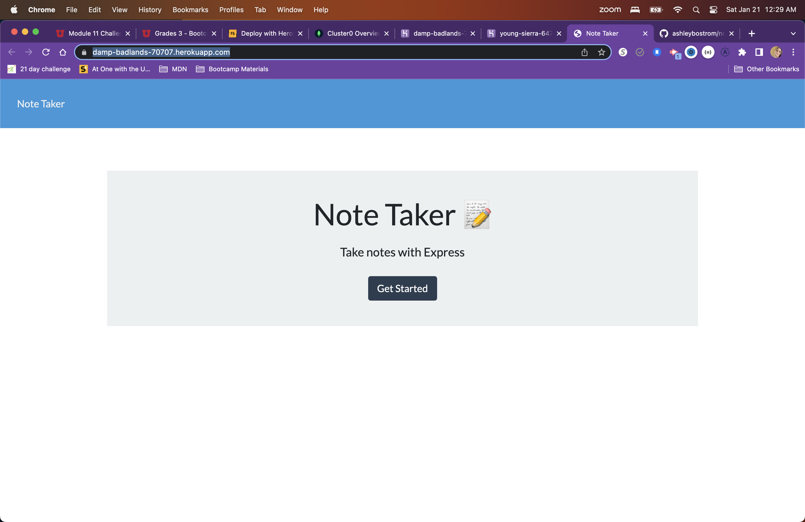
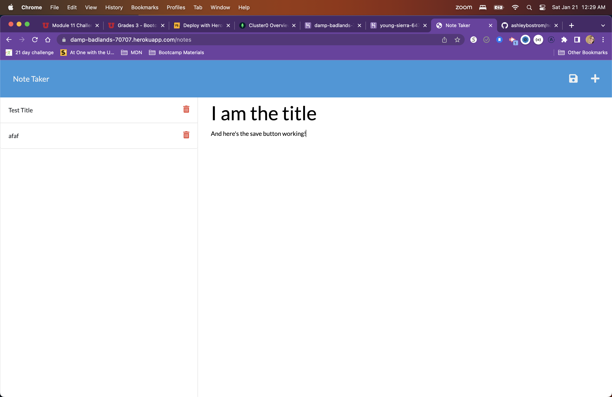

# NoTakers
This CLI App has been created to generate an application that will write and save notes in order to maximize time management, focus, and energy. This application uses Node.js && Express.js to save and retrieve the note data from a JSON file. 

## Table of Contents:
* [Installation](#installation)
* [Usage](#usage)
* [Mock-Up](#mockup)
* [Links](#links)

## Installation

### Technology Used:  
* HTML
* CSS
* JS
* Node.js
* Express.js
* Heroku

### How to start the project:  
1. **Copy link in code dropdown menu:** Copy the link with SSH key to clone the repo
1. **Clone:** In GitBash (Windows) or Terminal (Mac), type `git clone < $link >`
1. **NPM:** From the root directory, type `npm init` to install NPM (Node Package Manager)
1. **Dependencies:** Type `npm i` to install all dependencies needed

## Usage
Once the above steps are complete, the application is ready to run.

In your terminal, type `node server.js`

Now you are ready to create, save, and delete notes from your application!

## Mock-Up

## Links
1. [Heroku](https://damp-badlands-70707.herokuapp.com/)
1. [GitHub](https://ashleybostrom.github.io/notakers/)
